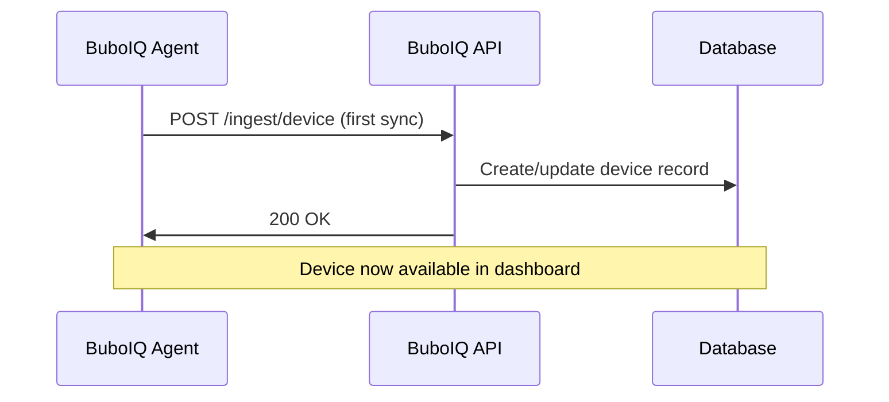
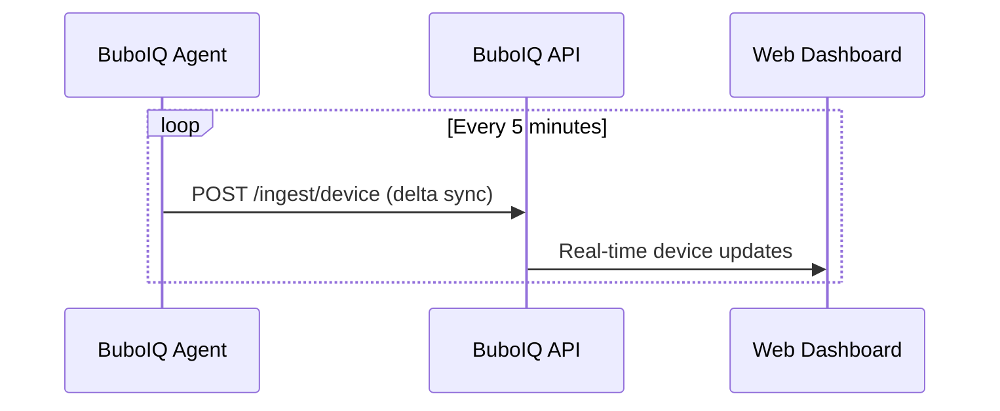
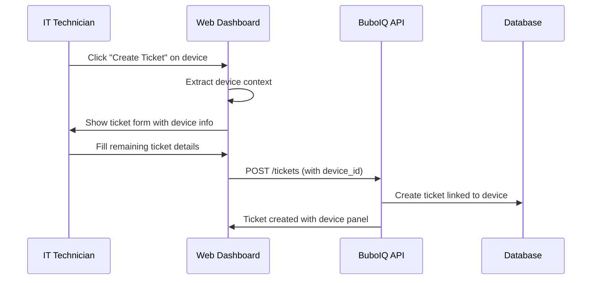

# BuboIQ Agent API Integration

This document describes how the BuboIQ Endpoint Agent integrates with the existing BuboIQ SaaS API to enable device context auto-population in tickets.

## Overview

The agent provides real-time device inventory, health monitoring, and remote management capabilities that seamlessly integrate with the existing ticket creation workflow to enable automatic device context population.

## API Endpoints Used

### Device Enrollment
```http
POST /auth/enroll
Content-Type: application/json

{
  "enrollment_code": "ACME-2024-ABC123",
  "device_info": {
    "hostname": "LAPTOP-USER-2024",
    "platform": "windows",
    "architecture": "amd64",
    "serial": "ABC123DEF456",
    "uuid": "550e8400-e29b-41d4-a716-446655440000",
    "mac": "00:1A:2B:3C:4D:5E"
  },
  "agent_version": "1.0.0"
}
```

**Response:**
```json
{
  "org_id": "org_uuid",
  "org_name": "Acme Corporation", 
  "device_id": "device_uuid",
  "api_key": "encrypted_api_key",
  "tls_config": {
    "cert_pins": ["sha256:..."],
    "min_version": "1.3"
  }
}
```

### Device Inventory Sync
```http
POST /ingest/device
Authorization: Bearer {api_key}
X-Org-ID: {org_id}
X-Device-ID: {device_id}
Content-Type: application/json

{
  "org_id": "org_uuid",
  "device": {
    "hostname": "LAPTOP-USER-2024",
    "platform": "windows",
    "os": {
      "name": "Windows 11 Pro",
      "version": "22H2",
      "build": "22621.2861",
      "architecture": "amd64"
    },
    "identifiers": {
      "serial": "ABC123DEF456",
      "uuid": "550e8400-e29b-41d4-a716-446655440000",
      "macs": ["00:1A:2B:3C:4D:5E"],
      "hostname": "LAPTOP-USER-2024",
      "machine_id": "S-1-5-21-1234567890"
    },
    "hardware": {
      "cpu": {
        "model": "Intel Core i7-12700H",
        "vendor": "Intel",
        "cores": 14,
        "threads": 20,
        "base_speed": 2.3,
        "max_speed": 4.7,
        "architecture": "x86_64"
      },
      "memory": {
        "total_mb": 32768,
        "available_mb": 16384,
        "used_mb": 16384
      },
      "gpu": [{
        "name": "NVIDIA GeForce RTX 3070",
        "vendor": "NVIDIA",
        "memory": 8192,
        "driver": "531.68"
      }],
      "battery": {
        "present": true,
        "percentage": 85.5,
        "status": "charging"
      }
    },
    "network": {
      "primary_ip": "10.0.1.156",
      "hostname": "LAPTOP-USER-2024",
      "domain": "corp.acme.com",
      "adapters": [{
        "name": "Ethernet",
        "type": "ethernet", 
        "mac": "00:1A:2B:3C:4D:5E",
        "ips": ["10.0.1.156"],
        "speed": 1000,
        "status": "up"
      }]
    },
    "software": [{
      "name": "Google Chrome",
      "version": "120.0.6099.109",
      "vendor": "Google LLC",
      "signed": true
    }],
    "collected_at": "2024-01-15T10:32:00Z",
    "hash": "abc123def456",
    "delta_of": "xyz789uvw012"
  },
  "health": {
    "cpu": {
      "usage_percent": 23.5,
      "core_usage": [25.2, 21.8, 24.1, 22.9]
    },
    "memory": {
      "usage_percent": 58.2,
      "total_mb": 32768,
      "used_mb": 19072
    },
    "overall_health": 87,
    "collected_at": "2024-01-15T10:32:00Z"
  },
  "agent_version": "1.0.0",
  "timestamp": "2024-01-15T10:32:00Z"
}
```

### Health Signals
```http
POST /signals
Authorization: Bearer {api_key}
X-Org-ID: {org_id}
X-Device-ID: {device_id}
Content-Type: application/json

{
  "type": "health_alert",
  "severity": "warning", 
  "title": "High CPU Usage Detected",
  "description": "CPU usage has been above 90% for 5 minutes",
  "metadata": {
    "cpu_usage": 94.2,
    "threshold": 90.0,
    "duration_seconds": 300
  },
  "timestamp": "2024-01-15T10:32:00Z",
  "device_id": "device_uuid"
}
```

### Remote Commands
```http
GET /agent/commands?device_id={device_id}
Authorization: Bearer {api_key}
X-Org-ID: {org_id}
```

**Response:**
```json
{
  "commands": [{
    "id": "cmd_uuid",
    "type": "rescan_inventory",
    "parameters": {
      "include_software": true,
      "full_scan": false
    },
    "timeout": "5m",
    "created_at": "2024-01-15T10:30:00Z",
    "expires_at": "2024-01-15T11:00:00Z"
  }]
}
```

### Command Response
```http
POST /agent/commands/{command_id}/response
Authorization: Bearer {api_key}
X-Org-ID: {org_id}
Content-Type: application/json

{
  "id": "cmd_uuid",
  "success": true,
  "output": "Inventory scan completed successfully",
  "duration": "00:00:15",
  "timestamp": "2024-01-15T10:32:00Z"
}
```

## Device Context Auto-Population Flow

### 1. Device Registration
When the agent starts, it registers the device with the BuboIQ platform:



### 2. Continuous Sync
The agent continuously syncs device state:



### 3. Ticket Creation with Device Context

When a user creates a ticket from a device detail page:



## Device Context Data Structure

When creating a ticket from a device, the following context is auto-populated:

```typescript
interface DeviceContext {
  id: string;               // Device UUID
  hostname: string;         // Computer name
  ip_address?: string;      // Primary IP address
  operating_system?: string; // OS name and version
  mac_address?: string;     // Primary MAC address
  serial_number?: string;   // Hardware serial
  health_score?: number;    // Current health (0-100)
  is_online?: boolean;      // Online status
}
```

### Ticket Form Auto-Population

```typescript
// When creating ticket from device detail page
const deviceContext: DeviceContext = {
  id: "550e8400-e29b-41d4-a716-446655440000",
  hostname: "LAPTOP-USER-2024", 
  ip_address: "10.0.1.156",
  operating_system: "Windows 11 Pro (22H2)",
  mac_address: "00:1A:2B:3C:4D:5E",
  serial_number: "ABC123DEF456",
  health_score: 87,
  is_online: true
};

// Auto-filled ticket fields
const ticketData = {
  title: `Issue with ${deviceContext.hostname}`,
  description: `Device: ${deviceContext.hostname}
IP Address: ${deviceContext.ip_address}
Operating System: ${deviceContext.operating_system}
MAC Address: ${deviceContext.mac_address}
Serial Number: ${deviceContext.serial_number}
Health Score: ${deviceContext.health_score}%
Status: ${deviceContext.is_online ? 'Online' : 'Offline'}

Issue Description:
[User fills this part]`,
  device_id: deviceContext.id,
  // ... other ticket fields
};
```

## Real-Time Updates

The agent provides real-time updates that keep the device information current:

### Health Monitoring
- CPU, memory, disk, network usage
- Temperature sensors
- Battery status (laptops)
- System uptime and load

### Status Changes
- Online/offline status
- Network connectivity changes
- Hardware changes (USB devices, etc.)
- Software installation/removal

### Event Streaming
```http
GET /events/stream?device_id={device_id}
Authorization: Bearer {api_key}
Accept: text/event-stream

data: {"type":"status_change","device_id":"...","status":"offline","timestamp":"..."}

data: {"type":"health_alert","device_id":"...","severity":"warning","metric":"cpu_usage","value":92.1}

data: {"type":"software_change","device_id":"...","action":"installed","software":"Chrome 121.0.0"}
```

## Security Considerations

### Authentication
- Agent uses unique API key per device
- JWT tokens include org_id, device_id, and permissions
- TLS 1.3 required for all communications
- Optional certificate pinning for enterprise deployments

### Data Protection
- All sensitive data encrypted in transit
- Device identifiers hashed for privacy
- Software inventory collection is optional
- BYOD redaction levels (none/limited/strict)

### Access Control
- Agents can only access their organization's data
- Row-level security (RLS) enforced in database
- API rate limiting per device
- Audit logging for all agent actions

## Error Handling

### Connection Failures
```json
{
  "error": "connection_failed",
  "message": "Failed to connect to BuboIQ API",
  "retry_after": 300,
  "backoff_multiplier": 2.0
}
```

### Authentication Errors
```json
{
  "error": "authentication_failed", 
  "message": "Invalid API key or expired token",
  "action": "re_enroll"
}
```

### Rate Limiting
```json
{
  "error": "rate_limited",
  "message": "Too many requests",
  "retry_after": 60,
  "limit": 100,
  "window": 3600
}
```

## Integration Testing

### Device Registration Test
```bash
# Test device enrollment
curl -X POST https://api.buboiq.com/auth/enroll \
  -H "Content-Type: application/json" \
  -d '{
    "enrollment_code": "TEST-2024-123",
    "device_info": {
      "hostname": "test-device",
      "platform": "linux"
    }
  }'
```

### Inventory Sync Test
```bash
# Test device inventory sync
curl -X POST https://api.buboiq.com/ingest/device \
  -H "Authorization: Bearer ${API_KEY}" \
  -H "X-Org-ID: ${ORG_ID}" \
  -H "Content-Type: application/json" \
  -d @device_inventory.json
```

### Ticket Creation Test
```bash
# Test ticket creation with device context
curl -X POST https://api.buboiq.com/tickets \
  -H "Authorization: Bearer ${API_KEY}" \
  -H "X-Org-ID: ${ORG_ID}" \
  -H "Content-Type: application/json" \
  -d '{
    "title": "Test ticket from device",
    "description": "Testing device context auto-population",
    "device_id": "'${DEVICE_ID}'",
    "priority": "medium"
  }'
```

This integration ensures that device information is always current and automatically available when creating tickets, streamlining the IT support workflow and reducing manual data entry.