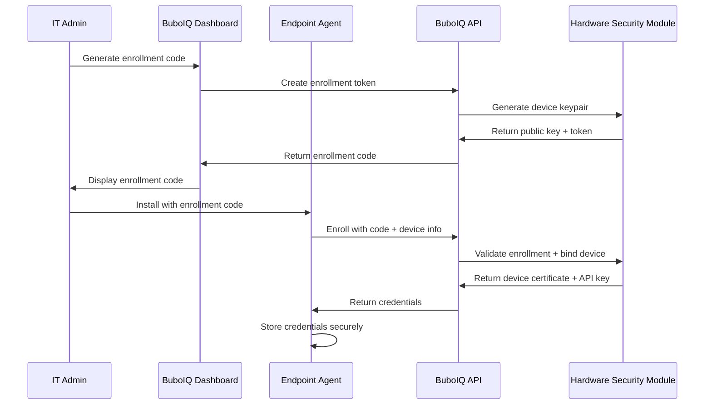

# BuboIQ Agent Security Architecture

This document outlines the comprehensive security model for the BuboIQ Endpoint Agent, covering encryption, authentication, privilege separation, and compliance requirements.

## Security Principles

### Defense in Depth
- Multiple layers of security controls
- Fail-safe defaults with deny-by-default policies
- Continuous monitoring and logging
- Regular security assessments

### Least Privilege
- Agent runs with minimal required privileges
- Service accounts with restricted permissions
- Granular access controls for different operations
- Temporary privilege elevation only when necessary

### Zero Trust Architecture
- Every request authenticated and authorized
- End-to-end encryption for all communications
- Device identity verification
- Continuous security posture assessment

## Authentication & Authorization

### Device Enrollment


### Enrollment Code Format
```
ORGANIZATION-YYYY-XXXXXX-CHECKSUM
Example: ACME-2024-A7B2C5-D8F1E3
```

- **Organization**: 4-8 character org identifier
- **Year**: Current year for code validity
- **Random**: 6-character alphanumeric identifier
- **Checksum**: 6-character validation hash

### API Authentication
Every API request includes:
```http
Authorization: Bearer <JWT_TOKEN>
X-Org-ID: <ORGANIZATION_UUID>
X-Device-ID: <DEVICE_UUID>
X-Device-Signature: <HMAC_SHA256_SIGNATURE>
```

### JWT Token Structure
```json
{
  "iss": "buboiq.com",
  "sub": "device:uuid",
  "aud": "api.buboiq.com", 
  "exp": 1640995200,
  "iat": 1640908800,
  "org_id": "550e8400-e29b-41d4-a716-446655440000",
  "device_id": "550e8400-e29b-41d4-a716-446655440001",
  "device_type": "endpoint_agent",
  "tier": "pro",
  "permissions": [
    "device:read",
    "device:write", 
    "signals:write",
    "commands:read"
  ]
}
```

## Encryption & Transport Security

### TLS Configuration
```yaml
tls_config:
  min_version: "1.3"
  cipher_suites:
    - "TLS_AES_256_GCM_SHA384"
    - "TLS_CHACHA20_POLY1305_SHA256"
    - "TLS_AES_128_GCM_SHA256"
  certificate_pinning:
    enabled: true
    pins:
      - "sha256:YLh1dUR9y6Kja30RrAn7JKnbQG/uEtLMkBgFF2Fuihg="
      - "sha256:C5+lpZ7tcVwmwQIMcRtPbsQtWLABXhQzejna0wHFr8M="
  verify_hostname: true
  verify_certificates: true
```

### Certificate Pinning
- Primary and backup certificate pins
- Automatic pin rotation on certificate renewal
- Graceful fallback for pin validation failures
- Emergency pin bypass for critical updates

### Data Encryption at Rest

#### Windows (DPAPI)
```go
// Encrypt sensitive data using Windows DPAPI
encryptedData, err := dpapi.EncryptBytes(sensitiveData, nil, "BuboIQ Agent")
if err != nil {
    return fmt.Errorf("encryption failed: %w", err)
}
```

#### macOS (Keychain Services)
```go
// Store sensitive data in macOS Keychain
err := keychain.AddGenericPassword(
    "BuboIQ Agent",     // service
    "api_key",          // account
    []byte(apiKey),     // password
    true,               // update if exists
)
```

#### Linux (Encrypted Files)
```go
// Encrypt with AES-256-GCM using system-derived key
key := deriveKeyFromMachine()
encryptedData, err := aes.EncryptGCM(sensitiveData, key)
if err != nil {
    return fmt.Errorf("encryption failed: %w", err)
}
```

## Privilege Separation

### Service Account Configuration

#### Windows
```yaml
service_account:
  name: "NT SERVICE\\BuboIQAgent"
  privileges:
    - "SeServiceLogonRight"
    - "SeCreateSymbolicLinkPrivilege"
  restrictions:
    - "SeDenyNetworkLogonRight" 
    - "SeDenyInteractiveLogonRight"
```

#### macOS
```yaml
service_account:
  user: "_buboiq"
  group: "_buboiq"
  uid: 300
  home: "/var/empty"
  shell: "/usr/bin/false"
```

#### Linux
```yaml
service_account:
  user: "buboiq"
  group: "buboiq"
  home: "/var/lib/buboiq"
  shell: "/bin/false"
  supplementary_groups: []
```

### File System Permissions

#### Configuration Files
```bash
# Linux/macOS
/etc/buboiq/agent.yaml
Owner: root:buboiq
Permissions: 640 (rw-r-----)

# Windows
C:\ProgramData\BuboIQ\agent.yaml
Owner: SYSTEM
Permissions: Full Control (SYSTEM, Administrators), Read (BuboIQ Service)
```

#### Log Files
```bash
# Linux/macOS
/var/log/buboiq/agent.log
Owner: buboiq:buboiq
Permissions: 644 (rw-r--r--)

# Windows
C:\ProgramData\BuboIQ\Logs\agent.log
Owner: BuboIQ Service
Permissions: Full Control (Service), Read (Administrators)
```

#### Binary Files
```bash
# Linux/macOS
/usr/local/bin/buboiq-agent
Owner: root:root
Permissions: 755 (rwxr-xr-x)

# Windows
C:\Program Files\BuboIQ\buboiq-agent.exe
Owner: TrustedInstaller
Permissions: Full Control (SYSTEM, Administrators), Execute (Users)
```

## Code Signing & Integrity

### Windows Code Signing
```powershell
# Sign with Extended Validation (EV) certificate
signtool sign /tr http://timestamp.digicert.com /td sha256 /fd sha256 /a buboiq-agent.exe

# Verify signature
signtool verify /pa /v buboiq-agent.exe
```

### macOS Code Signing
```bash
# Sign with Developer ID certificate
codesign --sign "Developer ID Application: BuboIQ, Inc." \
         --options runtime \
         --timestamp \
         buboiq-agent

# Verify signature
codesign --verify --verbose buboiq-agent
```

### Linux Package Signing
```bash
# Sign DEB package
dpkg-sig --sign builder buboiq-agent_1.0.0_amd64.deb

# Sign RPM package  
rpm --addsign buboiq-agent-1.0.0-1.x86_64.rpm
```

### Integrity Verification
All binaries include embedded checksums:
```go
const (
    ExpectedSHA256 = "a8f5f167f44f4964e6c998dee827110c"
    ExpectedSize   = 15728640
)

func verifyBinaryIntegrity() error {
    executable, err := os.Executable()
    if err != nil {
        return err
    }
    
    file, err := os.Open(executable)
    if err != nil {
        return err
    }
    defer file.Close()
    
    hasher := sha256.New()
    if _, err := io.Copy(hasher, file); err != nil {
        return err
    }
    
    calculatedHash := hex.EncodeToString(hasher.Sum(nil))
    if calculatedHash != ExpectedSHA256 {
        return fmt.Errorf("binary integrity check failed")
    }
    
    return nil
}
```

## Network Security

### Firewall Configuration
```yaml
outbound_rules:
  - protocol: "HTTPS"
    destination: "api.buboiq.com"
    port: 443
    description: "BuboIQ API communication"
  
  - protocol: "HTTPS"
    destination: "updates.buboiq.com"
    port: 443
    description: "Agent updates"

inbound_rules: []  # No inbound connections required
```

### DNS Security
```yaml
dns_config:
  secure_dns: true
  dns_over_https: true
  dns_servers:
    - "1.1.1.1"  # Cloudflare
    - "8.8.8.8"  # Google
  domain_validation:
    - "*.buboiq.com"
    - "api.buboiq.com" 
    - "updates.buboiq.com"
```

### Request Rate Limiting
```yaml
rate_limits:
  inventory_sync: "1/minute"
  health_signals: "10/minute"
  command_polling: "1/minute"
  error_reporting: "5/minute"
  
  burst_allowance: 3
  backoff_multiplier: 2.0
  max_backoff: "5 minutes"
```

## Data Protection & Privacy

### Data Classification
```yaml
data_classification:
  public:
    - hostname
    - operating_system
    - agent_version
    
  internal:
    - ip_address
    - mac_address
    - hardware_specs
    - software_inventory
    
  confidential:
    - serial_numbers
    - device_uuid
    - api_keys
    - user_data_paths
    
  restricted:
    - encryption_keys
    - authentication_tokens
    - personal_files_metadata
```

### Privacy Controls
```yaml
privacy_settings:
  collect_software_inventory:
    default: true
    user_configurable: true
    description: "Collect installed software list"
    
  byod_redaction:
    options: ["none", "limited", "strict"]
    default: "limited"
    description: "Personal device data redaction level"
    
  data_retention:
    options: [90, 180, 365]  # days
    default: 180
    description: "How long to retain device data"
    
  export_controls:
    admin_only: true
    formats: ["csv", "json"]
    max_size: "10MB"
```

### Data Minimization
```go
type RedactionConfig struct {
    Level RedactionLevel `yaml:"level"`
    Rules []RedactionRule `yaml:"rules"`
}

type RedactionRule struct {
    Field   string `yaml:"field"`
    Action  string `yaml:"action"`  // hash, mask, remove
    Pattern string `yaml:"pattern,omitempty"`
}

func (r *RedactionConfig) ApplyRedaction(data interface{}) interface{} {
    switch r.Level {
    case RedactionNone:
        return data
    case RedactionLimited:
        return r.redactPersonalData(data)
    case RedactionStrict:
        return r.redactAllSensitiveData(data)
    }
    return data
}
```

## Audit Logging

### Security Events
```json
{
  "timestamp": "2024-01-15T10:32:00Z",
  "event_type": "security_event",
  "severity": "high",
  "category": "authentication",
  "event": "enrollment_success",
  "actor": {
    "type": "agent",
    "device_id": "550e8400-e29b-41d4-a716-446655440000",
    "ip_address": "10.0.1.156"
  },
  "details": {
    "enrollment_code": "ACME-2024-******",
    "organization": "Acme Corporation",
    "enrollment_method": "installer"
  },
  "metadata": {
    "user_agent": "BuboIQ-Agent/1.0.0",
    "platform": "windows",
    "architecture": "amd64"
  }
}
```

### Audit Trail Categories
- **Authentication Events**: Login, logout, enrollment, token refresh
- **Authorization Events**: Permission grants, access denials, privilege escalation
- **Data Access Events**: Configuration reads, sensitive data access
- **System Events**: Service start/stop, crashes, updates
- **Network Events**: Connection attempts, certificate validation, rate limiting
- **Security Events**: Integrity checks, signature validation, anomalies

### Log Retention & Protection
```yaml
audit_logging:
  local_retention: "30 days"
  remote_retention: "2 years" 
  encryption: "AES-256-GCM"
  signing: "HMAC-SHA256"
  rotation: "daily"
  max_size: "100MB"
  
  protected_events:
    - "authentication_failure"
    - "privilege_escalation"
    - "configuration_change"
    - "security_violation"
```

## Incident Response

### Security Incident Detection
```go
type SecurityMonitor struct {
    metrics     *MetricsCollector
    alerting    *AlertManager
    quarantine  *QuarantineManager
}

func (s *SecurityMonitor) DetectAnomalies() {
    // Multiple failed authentication attempts
    if s.metrics.FailedAuthCount() > 5 {
        s.alerting.RaiseAlert("repeated_auth_failure", AlertHigh)
    }
    
    // Unexpected privilege escalation
    if s.detectPrivilegeEscalation() {
        s.alerting.RaiseAlert("privilege_escalation", AlertCritical)
        s.quarantine.IsolateAgent()
    }
    
    // Binary integrity violation
    if !s.verifyBinaryIntegrity() {
        s.alerting.RaiseAlert("binary_tampering", AlertCritical)
        s.quarantine.DisableAgent()
    }
}
```

### Emergency Response Procedures
1. **Immediate Isolation**: Disconnect agent from network
2. **Evidence Preservation**: Secure logs and forensic data
3. **Stakeholder Notification**: Alert security team and management
4. **Impact Assessment**: Determine scope and severity
5. **Remediation**: Apply fixes and security patches
6. **Recovery**: Restore normal operations
7. **Post-Incident Review**: Analyze and improve procedures

### Recovery Mechanisms
```yaml
recovery_options:
  safe_mode:
    description: "Minimal functionality mode"
    enabled_features: ["basic_inventory", "emergency_commands"]
    disabled_features: ["software_inventory", "remote_access"]
    
  agent_reset:
    description: "Reset to factory defaults"
    preserves: ["device_id", "organization_binding"]
    resets: ["configuration", "credentials", "local_cache"]
    
  emergency_update:
    description: "Force update to fix security issues"
    bypass_checks: ["signature_validation", "rollback_protection"]
    requires: ["admin_approval", "incident_ticket"]
```

## Compliance & Certifications

### Standards Compliance
- **NIST Cybersecurity Framework**: Identify, Protect, Detect, Respond, Recover
- **ISO 27001**: Information Security Management System
- **SOC 2 Type II**: Security, Availability, Confidentiality controls
- **GDPR**: Data protection and privacy requirements
- **CCPA**: California Consumer Privacy Act compliance

### Security Certifications
- **Common Criteria EAL4+**: Security evaluation certification
- **FIPS 140-2 Level 2**: Cryptographic module certification
- **FedRAMP**: Federal Risk and Authorization Management Program

### Regular Security Assessments
```yaml
security_assessments:
  penetration_testing:
    frequency: "quarterly"
    scope: ["agent", "api", "infrastructure"]
    standards: ["OWASP", "NIST SP 800-115"]
    
  vulnerability_scanning:
    frequency: "weekly"
    tools: ["nessus", "qualys", "rapid7"]
    coverage: ["dependencies", "configuration", "network"]
    
  code_review:
    frequency: "every_commit"
    tools: ["sonarqube", "checkmarx", "veracode"]
    coverage: ["security", "quality", "dependencies"]
    
  dependency_scanning:
    frequency: "daily"
    tools: ["snyk", "dependabot", "whitesource"]
    scope: ["direct", "transitive", "build"]
```

## Security Metrics & Monitoring

### Key Security Indicators
```yaml
security_metrics:
  authentication_success_rate: "> 99%"
  certificate_validation_rate: "100%"
  encryption_coverage: "100%"
  patch_deployment_time: "< 24 hours"
  incident_response_time: "< 1 hour"
  security_training_completion: "> 95%"
```

### Continuous Monitoring
- Real-time threat detection
- Behavioral anomaly analysis
- Configuration drift detection
- Certificate expiration monitoring
- Vulnerability assessment automation
- Security posture dashboards

This comprehensive security architecture ensures the BuboIQ Agent maintains the highest security standards while providing the functionality needed for effective IT support and device management.